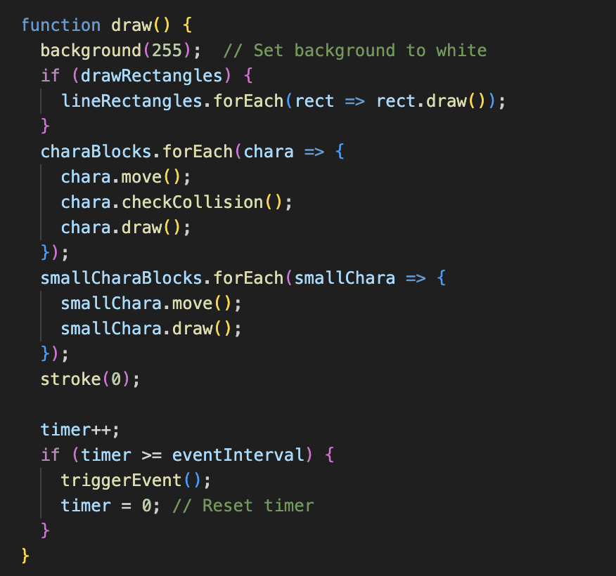
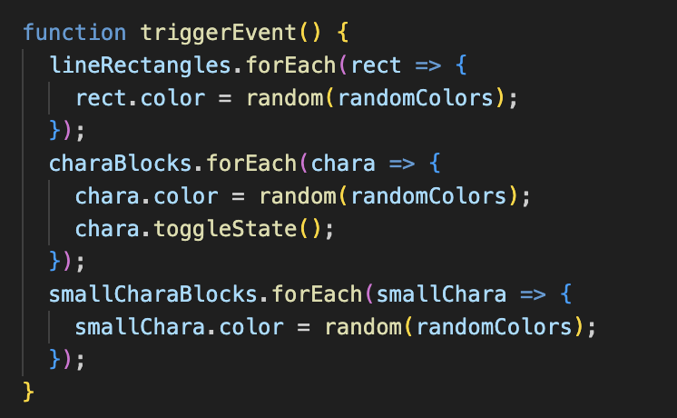
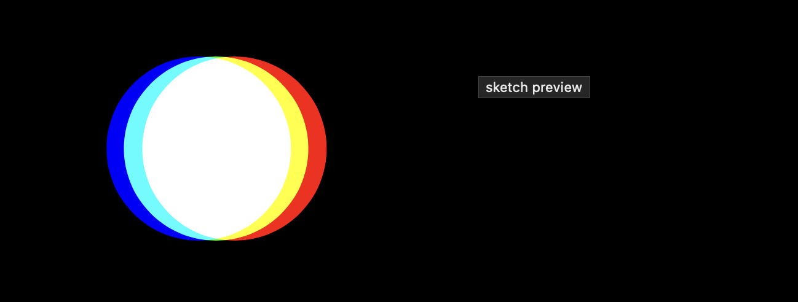
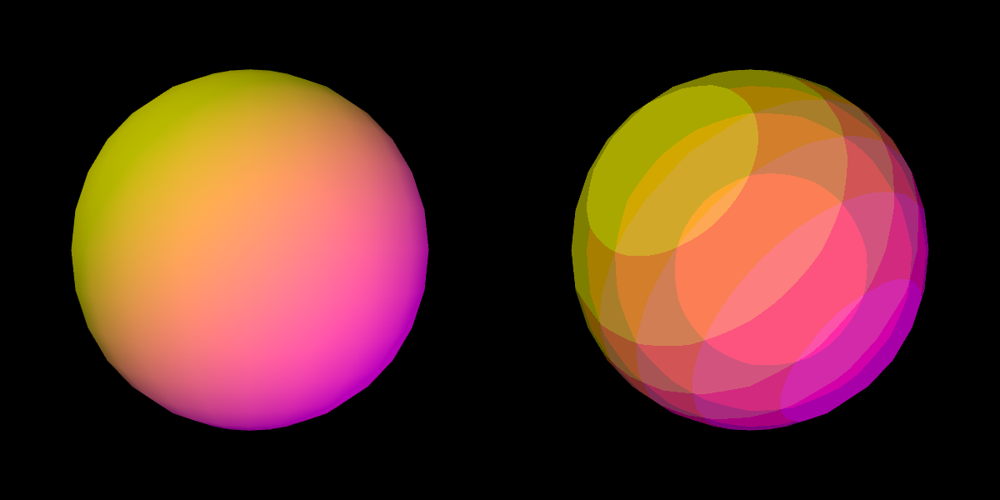

# prpo0789_9103_tut10

# Functioning prototype 

**Individual Task:**
Time-Based:Employ timers and events for animation.
The code employs timers and events for animation, particularly using the timer variable and the eventInterval to create time-based changes. 

**Timer and Event Interval**
eventInterval: This variable is set to 40, indicating that an event will occur every 40 frames.
timer: This variable keeps track of the number of frames that have passed.

# Explanation

Frame Count Increment:
- timer++: This line increments the timer variable by 1 in each frame.

Event Trigger:
- if (timer >= eventInterval) {: This condition checks if the timer has reached or exceeded the eventInterval (40 frames).
- triggerEvent();: If the condition is met, the triggerEvent function is called to perform specific actions (like changing colors and toggling states).
- timer = 0;: The timer is reset to 0 after triggering the event, allowing the process to start over for the next 40 frames.

# Trigger Event Function

Explanation
- Change Colors:
- All rectangles and character blocks change their colors randomly.

Toggle State:
- The state (movement direction) of the large character blocks is toggled.

# Design research 

**Part 1: Imaging Technique Inspiration**

For our assignment based on Piet Mondrian's "Broadway Boogie Woogie," I'm inspired by the technique of motion blur, commonly seen in photography and film. This technique captures the dynamic movement and energy present in the artwork. By incorporating motion blur into our project, we can simulate the sense of movement and rhythm inspired by the boogie-woogie music. This adds depth and realism to our visual representation, enhancing the overall experience for the viewer.

**Part 2: Coding Technique Exploration**

To implement motion blur in our project, we can explore the use of WebGL shaders. Shaders allow for complex visual effects to be applied to images and animations in real-time. By using motion blur shaders, we can achieve a realistic blur effect that simulates the movement of objects in the artwork. Here's an example implementation using WebGL shaders : [Link Text](https://editor.p5js.org/AhmadMoussa/sketches/VrZs1OLQG) and [Link Text](https://github.com/BarneyWhiteman/p5.filterShader) 

