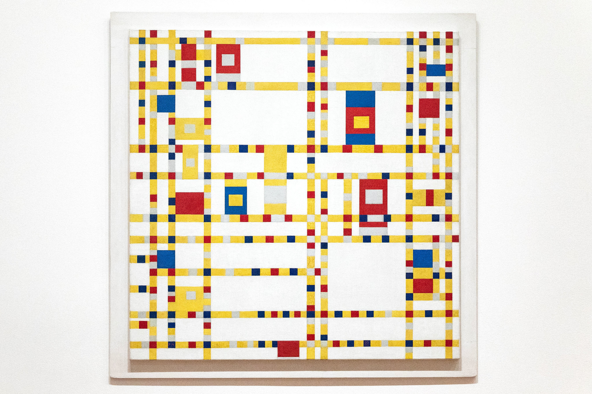

# prpo0789_9103_tut10

# Design research 

**Bold Text** or __Bold Text__
*Italic Text* or _Italic Text_

- Item 1
- Item 2
  - Subitem 2.1
  - Subitem 2.2

  1. First Item
2. Second Item
3. Third Item

**Part 1: Imaging Technique Inspiration**

For our assignment based on Piet Mondrian's "Broadway Boogie Woogie," I'm inspired by the technique of motion blur, commonly seen in photography and film. This technique captures the dynamic movement and energy present in the artwork. By incorporating motion blur into our project, we can simulate the sense of movement and rhythm inspired by the boogie-woogie music. This adds depth and realism to our visual representation, enhancing the overall experience for the viewer.

![Image Description]

**Part 2: Coding Technique Exploration**

To implement motion blur in our project, we can explore the use of WebGL shaders. Shaders allow for complex visual effects to be applied to images and animations in real-time. By using motion blur shaders, we can achieve a realistic blur effect that simulates the movement of objects in the artwork. Here's an example implementation using WebGL shaders
