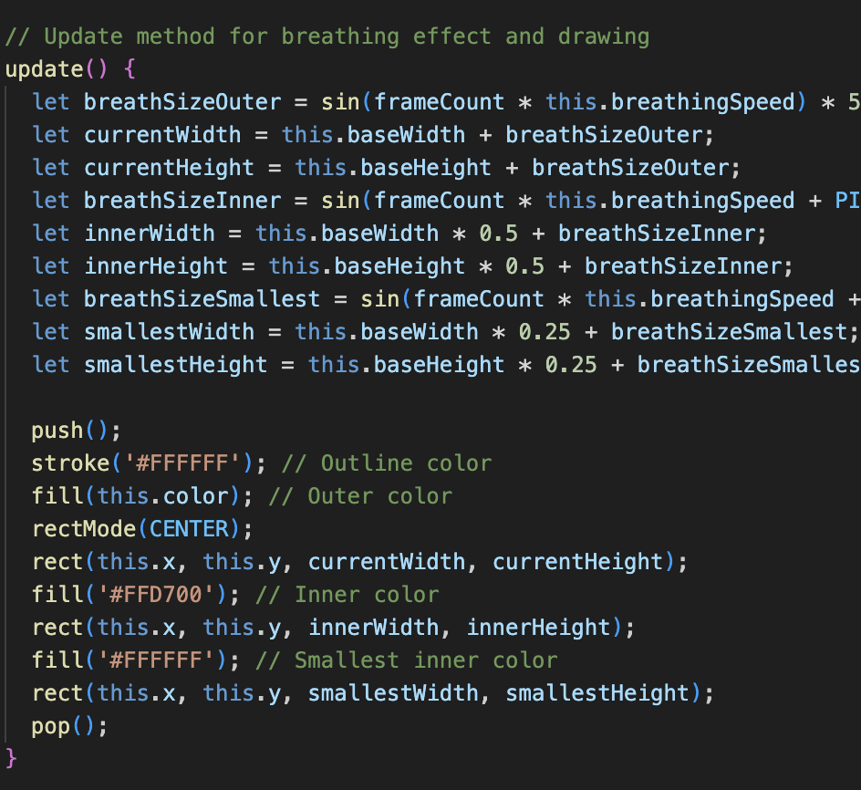

# prpo0789_9103_tut10

# Functioning prototype 

This artwork evokes a sense of chaos and randomness for me. The pulsating rhythm and vibrations in the composition remind me of the neon lights, traffic, and grid of New York City streets (Artchive, n.d.). This is why I want to make this artwork move randomly, capturing its chaotic nature perfectly through a time-based method.

**Individual Task:**
Time-Based:Employ timers and events for animation.
The code employs timers and events for animation, particularly using the timer variable and the eventInterval to create time-based changes. 

**Timer and Event Interval**
eventInterval: This variable is set to 40, indicating that an event will occur every 40 frames.
timer: This variable keeps track of the number of frames that have passed.

### Acknowledgment
As part of my design process, I utilized ChatGPT, an AI developed by OpenAI, to gain insights and inspiration for my animation techniques. The AI's recommendations on implementing a breathing effect and periodic events were particularly valuable, enhancing the interactivity and visual appeal of my project. 

## Properties Animated
**Movement:**

Chara Blocks (Large): These blocks move horizontally or vertically and bounce off the boundaries. Their movement direction can also be toggled,adding an extra layer of complexity to their behavior.
Small Chara Blocks: These blocks move in both x and y directions, bouncing off the boundaries when they collide,making their movement more dynamic compared to static or linear movement.

**Breathing Effect (Size Change):**

Chara Blocks (Large): These blocks have a breathing effect, where their size oscillates over time, creating a pulsing effect.
Small Chara Blocks: These blocks also have a breathing effect, where their size oscillates over time, though at a different speed compared to the large character blocks. 

## Unique Features
**Periodic Color Changes:**

The code uses a timer to periodically change the colors of all rectangles and character blocks, creating a dynamic and visually appealing effect that is synchronized across all components.

## Inspiration for animating
Breath Size Calculation:

breathSizeOuter, breathSizeInner, and breathSizeSmallest use the sin function to create a smooth oscillation effect.
The oscillation is scaled to adjust the size of the rectangles, giving the appearance of breathing or pulsing.

# Explanation

Breath Size Calculation:

- The variables breathSizeOuter, breathSizeInner, and breathSizeSmallest use the sin function to create a smooth, wave-like effect. This effect changes the size of the rectangles, making them look like they are breathing or pulsing.

Dynamic Size Changes:

- The size of the character blocks changes over time using the sin function, creating a continuous breathing effect. By using different phases of the sin function (e.g., adding PI / 2 or PI), we can create layered breathing effects. This makes the overall movement more complex and lifelike.

Frame Count Increment:
- timer++: This line increments the timer variable by 1 in each frame.

Event Trigger:
- if (timer >= eventInterval) {: This condition checks if the timer has reached or exceeded the eventInterval (40 frames).
- triggerEvent();: If the condition is met, the triggerEvent function is called to perform specific actions (like changing colors and toggling states).
- timer = 0;: The timer is reset to 0 after triggering the event, allowing the process to start over for the next 40 frames.

# Trigger Event Function

Explanation
- Change Colors:
- All rectangles and character blocks change their colors randomly.

Toggle State:
- The state (movement direction) of the large character blocks is toggled.

# Design research 

**Part 1: Imaging Technique Inspiration**

For our assignment based on Piet Mondrian's "Broadway Boogie Woogie," I'm inspired by the technique of motion blur, commonly seen in photography and film. This technique captures the dynamic movement and energy present in the artwork. By incorporating motion blur into our project, we can simulate the sense of movement and rhythm inspired by the boogie-woogie music. This adds depth and realism to our visual representation, enhancing the overall experience for the viewer.

**Part 2: Coding Technique Exploration**

To implement motion blur in our project, we can explore the use of WebGL shaders. Shaders allow for complex visual effects to be applied to images and animations in real-time. By using motion blur shaders, we can achieve a realistic blur effect that simulates the movement of objects in the artwork. Here's an example implementation using WebGL shaders : [Link Text](https://editor.p5js.org/AhmadMoussa/sketches/VrZs1OLQG) and [Link Text](https://github.com/BarneyWhiteman/p5.filterShader) 

